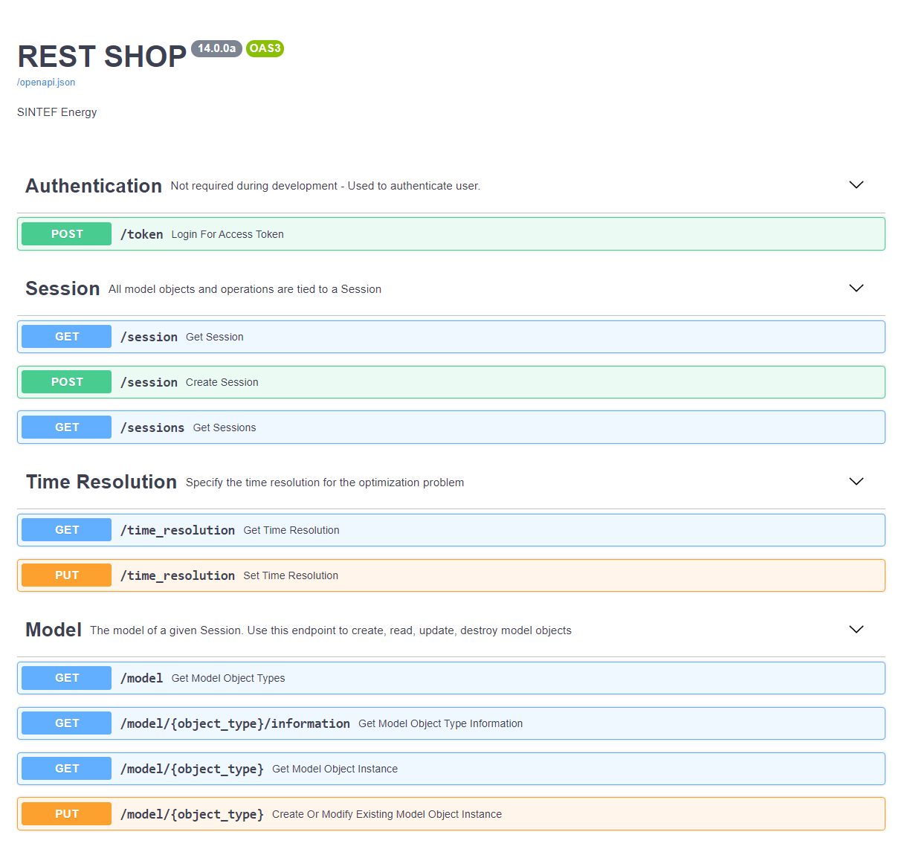

# ASSUMING YOU ARE STANDING AT ROOT OF REPO

# Add missing dependencies from SHOP/SDK/pyshop to `SDK/pyshop`

> Use version 14.0.0 of SHOP to copy these files from.

- shop_cplex_interface.dll
- shop_osi_interface.dll
- shop_pybind.pyd

# Make sure you have a python environment

Currently pyshop supports python versions 3.7.x and 3.8.x.
Be aware that python version must match same as that used to build `shop_pybind.pyd` from SHOP.

`conda create -n SHOP python=3.7`

# Activate your environment

`conda activate SHOP`

# Install pyshop in editable mode

`pip install -e SDK`

# Install shop_rest in editable mode

`pip install -e .`

# Test the server without starting it

`pytest`

# Start up the server

`uvicorn main:app --reload`

# Use the SwaggerUI to play around with requests

Open this link -> [localhost:8000/docs](localhost:8000/docs)

# Debug using vscode

Hit F5 and choose FastAPI

