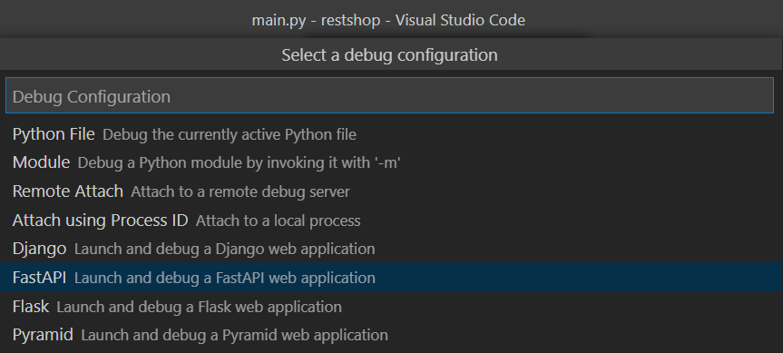

# 1 Clone

`git clone https://gitlab.com/sintef/restshop.git`

**From now on it is assumed that you're standing at the root of this repo**

# 2 Add missing dependencies from SHOP/SDK/pyshop to `SDK/pyshop`

> Use version 14.0.0 of SHOP to copy these files from.

- shop_cplex_interface.dll
- shop_osi_interface.dll
- shop_pybind.pyd

# 3 Make sure you have a python environment

> **NOTE**: Currently pyshop supports python versions 3.7.x and 3.8.x. The python version must match the one used when building `shop_pybind.pyd` from SHOP.

> **NOTE**: It is recommended to create a new environment, you don't have to call it "SHOP". Even though it is possible to reuse an existing environment, this is not recommended.

`conda create -n SHOP python=3.7`

# 4 Activate your environment

`conda activate SHOP`

# 5 Install pyshop in editable mode

`pip install -e SDK`

# 6 Test pyshop installation

`python -c "import pyshop; pyshop.ShopSession(); print('ok')"`

> **NOTE**: You should see `ok` printed. If you get a bunch of text followed by `ImportError: DLL ...` then check your python version `python --version`. Go back to step 3 and try with another python version, for example 3.8 <-> 3.7.

# 7 Install shop_rest in editable mode

`pip install -e .`

# 8 Test the server without starting it

`pytest`

# 9 Start up the server

`uvicorn main:app --reload`

# 10 Use the SwaggerUI to play around with requests

Open this link -> [localhost:8000/docs](localhost:8000/docs)

# 11 Debug using vscode

Hit F5 and choose FastAPI

